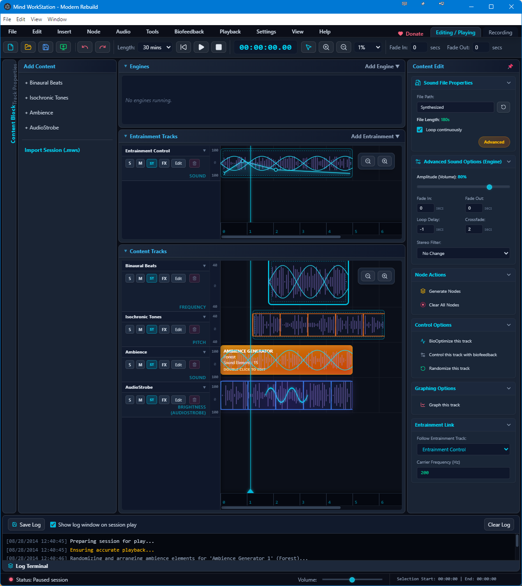

# Mind WorkStation (Open Source Clone)


A modern, web-based, and desktop-ready clone of the classic **Mind WorkStation** software. This project aims to bring professional brainwave entrainment, audio stimulation, and biofeedback tools to modern operating systems using web technologies (React, TypeScript, Tone.js, and Electron).

### 📸 Screenshot


### 🎥 Video Demo
<video src="https://github.com/syaifulwachid/Mind-WorkStation-Modern-Build/raw/main/public/demo_video.mp4" controls="controls" width="100%"></video>

## 🚀 Features

*   **Binaural Beats & Isochronic Tones:** High-quality, real-time audio generation powered by Tone.js.
*   **AudioStrobe Integration:** Built-in support for generating AudioStrobe-compatible signals for mind machines.
*   **Advanced Timeline Editor:** An interactive timeline with envelope graphing to accurately control pitch, frequency, and volume over time.
*   **Ambience Generator:** Integrated ambient soundscape generator.
*   **Audio Mixdown Export:** Export your complete session as a high-quality `.wav` file.
*   **Live Recording:** Record microphone inputs directly into your sessions.
*   **Modern UI:** A beautiful, dark-themed interface built with Tailwind CSS, inspired by the classic MWS layout but modernized for today's screens.
*   **Cross-Platform Desktop App:** Packaged with Electron to run natively on Windows, macOS, and Linux.

## 🛠️ Technology Stack

*   **Frontend:** React 19, TypeScript, Vite
*   **Styling:** Tailwind CSS, Lucide React
*   **Audio Engine:** Tone.js
*   **State Management:** Zustand
*   **Desktop Wrapper:** Electron & Vite-Plugin-Electron

## ⚙️ Installation & Development

To get started with developing and contributing to this project, follow these steps:

### Prerequisites

*   [Node.js](https://nodejs.org/) (v18 or higher recommended)
*   npm or yarn or pnpm

### Getting Started

1.  **Clone the repository**
    ```bash
    git clone https://github.com/yourusername/mindworkstation-clone.git
    cd mindworkstation-clone
    ```

2.  **Install dependencies**
    ```bash
    npm install
    ```

3.  **Run the development server & Electron app**
    ```bash
    npm run dev
    ```
    This command will start the Vite development server and launch the Electron application simultaneously.

4.  **Build for production**
    ```bash
    npm run build
    ```

## 🤝 Contributing

We welcome contributions from developers, audio engineers, and brainwave entrainment enthusiasts! If you're interested in helping us develop this program further, here are a few ways you can contribute:

*   **Bug Reports & Feature Requests:** Open an issue to let us know what needs fixing or what features you'd like to see.
*   **Audio Engine Optimization:** Help us improve the precision and efficiency of the Tone.js audio synthesizers.
*   **UI/UX Improvements:** Enhance the timeline graph, inspector panels, and overall user flow.
*   **Biofeedback Integration:** If you have experience with EEG or biofeedback devices, we'd love your help integrating hardware support!

### How to Contribute
1. Fork the repository
2. Create a new branch (`git checkout -b feature/your-amazing-feature`)
3. Commit your changes (`git commit -m 'Add some amazing feature'`)
4. Push to the branch (`git push origin feature/your-amazing-feature`)
5. Open a Pull Request

## ❤️ Support & Donation

If you find this project useful and would like to support its continued development, you can donate via QRIS (Indonesian standard QR code payment) from the "Donate" tab within the app itself. 

---

*Disclaimer: This project is an independent, open-source clone and is not affiliated with or endorsed by Transparent Corporation.*
